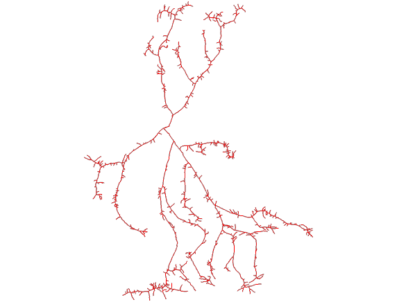
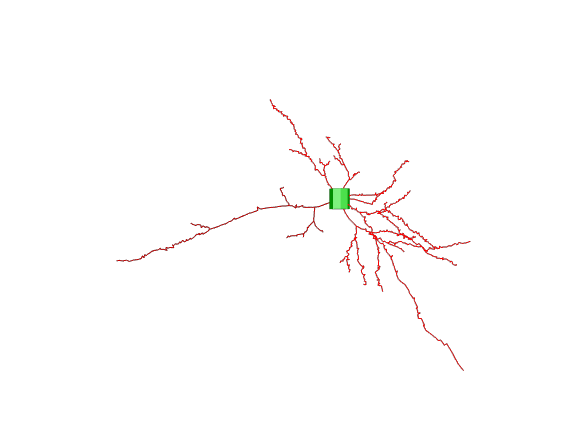
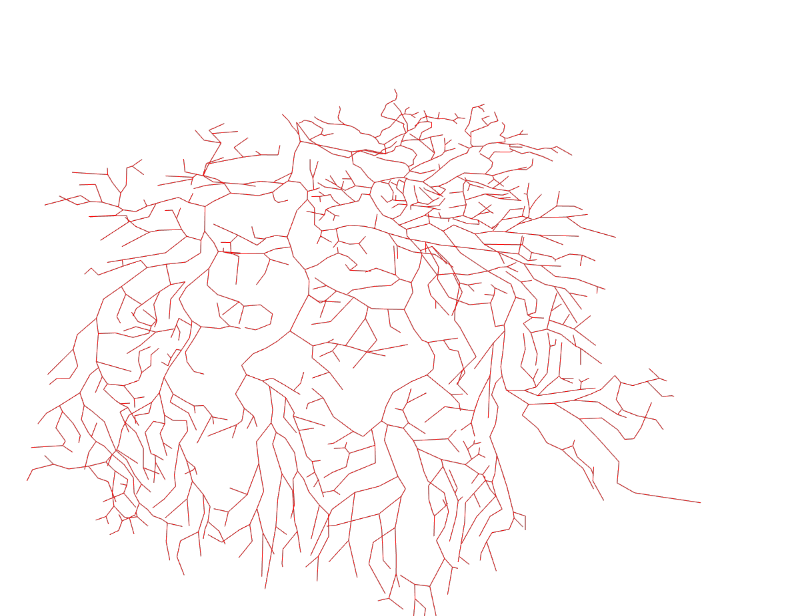

# Cognitive-Modeling

## Steps 

I am currently using `neuronm` which can be installed by running 
```bash
pip install neurom
```

run from the project root `src/visualizer.py data/file_name` to visualize the neuron `

Valid filenames are 

- neuron1.swc
- neuron2.swc
- neuron3.swc


## Issues

- Neuron1 and Neuron3 currently cannot be visualized using this.
You can use `https://neuroinformatics.nl/HBP/morphology-viewer/` to visualize the neuron. 

## Neurons 

###  Neuron1

Sensory Cell


### Neuron2

Pyramidal Cell



### Neuron3

Purkinje Cell



