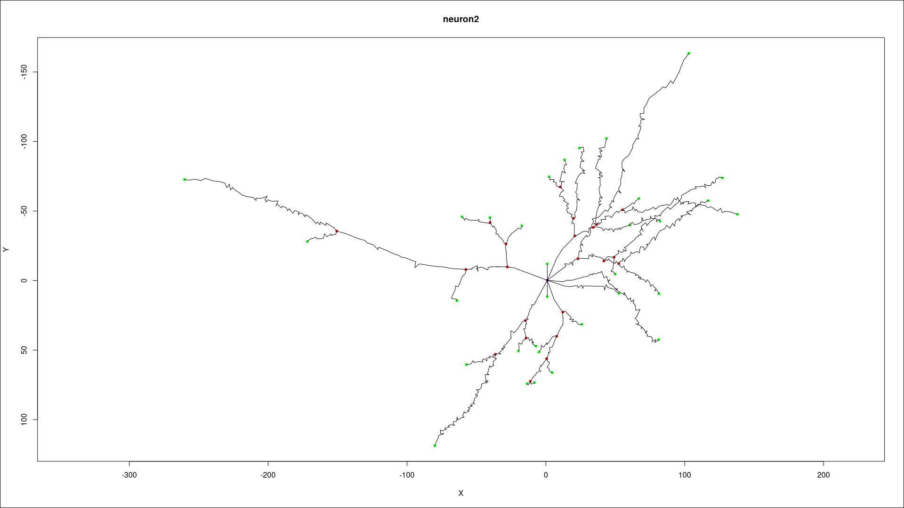

# Cognitive-Modeling

## Steps 

We are currently using `neuronm` which can be installed by running 
```bash
pip install neurom
```


run from the project root `src/visualizer.py data/file_name` to visualize the neuron `

Valid filenames are 

- neuron1.swc
- neuron2.swc
- neuron3.swc

As the python package had some known issues and could not load Neurons 1 and 3, we swtiched to the ```nat``` package provided in the `R` environment. The package can be installed by running the follwing
```R
install.packages("nat") 
```
To get the 3d output go to the src directory and run `Rscript visualizer.r`


## Neurons 

###  Neuron1

Sensory Cell


3D image: 


2D image: 


### Neuron2

Pyramidal Cell


3D image: 


2D image: 


### Neuron3

Purkinje Cell


3D image: 


2D image: 


